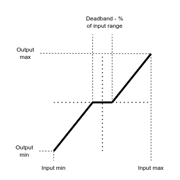

# Tutorial 2 - Autocode generation
This tutorial will outline the process to add a new vehicle to the framework as well as showcasing the input and output functionality and log review.

## Hardware components

* FMU-MINI
* SBUS receiver and transmitter
* Mavlink telemetry module

Make the appropriate connections between the hardwares and ensure that the radio modules are bound to each other. 

## Adding a new vehicle
When adding a new vehicle for development, several things needs to be updated within the C++ and MATLAB/Simulink portion of the code

For this tutorial, let's create a new vehicle name "test" with a correponding control law name "test_vms". It is noted several features in the normal SPAARO application has been disabled, i.e. GPS check, EKF, to ensure the minimum hardware needed to follow the this tutorial. Disabled code snippets are denoted as such in the corresponding C++ files. 

### C++ Modifications
A config file for the new vehicle must first be created to reflect the hardware setup. One can copy the baseline ```/flight_code/flight/config.cc``` to ```/flight_code/flight/config_test.cc``` and make any neccessary changes (everything is default in this tutorial).

Then in ```/flight_code/CMakeLists.txt```, one need to configure CMake to target the correct config file based on the ```-D VEHICLE``` argument. At around line 54 where there is an if expression ```if(VEHICLE STREQUAL "<VEHICLE_NAME>")```. For this example, add the following lines before the ```else()``` expression

```
elseif (VEHICLE STREQUAL "TEST")
  message("Using TEST config.cc")
  set(CONFIG_CC config_test.cc)
```

### MATLAB Modification
First, a vehicle specific matlab file definition is needed. One can copy the baseline ```/simulation/aircraft/tutorial.m``` to ```/simulation/aircraft/test.m```. In the new file, make sure to change to ```Aircraft.name='test'```. 

In ```/simulation/config.m``` file, toward the top where there are a list of vehicle to choose, add ```vehicle='test';```. Around line 19 where one configure which FMU to choose. Since we are targeting the *FMU-MINI* hardware, one can append the if expression corresponding to ```fmu_version='mini'``` with ``` || strcmpi(vehicle, 'test')```. This will add the new ```test``` vehicle to a list of existing vehicle supported by lager_spaaro as well as assign ```test``` to use *FMU-MINI*.

Make a new VMS or control law simulink model. Duplicate the ```/simulation/vms/tutorial_vms.slx``` to ```/simulation/vms/test_vms.slx```. 

In ```/simulation/setup.m``` file, around line 132 where one can select which VMS file to open if the ```vms_only``` option is set to true. Add the following line at the end of the if-elseif structure
```
elseif strcmp (vehicle,'test')
    test_vms()
```

This setup so that when running ```setup.m``` with the configuration prescribed in this tutorial, the ```/simulation/vms/test_vms.slx``` is opened.

### Build and upload
After these modification, a new vehicle is added to SPAARO and can be compiled and uploaded to the FMU for vehicle name ```test``` following the build instruction in Tutorial 1. Ensure that an micro SD card is inserted for logging, if not, the flight code will throw an error message in the serial monitor. Since the debug mode is set to true in ```/flight_code/flight/config_test.cc```, one needs to open a serial monitor for the rest of the flight code to proceed. After then, one can attempt to connect the FMU to a ground control software such as Mission Planner.

## Input and Output demonstration

This section mainly explain the contents of the ```/simulation/vms/tutorial_vms.slx``` which is the same as the ```/simulation/vms/test_vms.slx```. This tutorial hopes to explain the typical implementation for reading and processing inceptor signal(RC commands), telemetry parameters, logging. Comments are in the simulink model but some explanation is provided here.

First, the signals of interested are extracted from the data structures (or buses) using ```Bus Selector``` blocks. In this example, the ```sensor.inceptor.ch``` and ```telem.param``` arrays are extracted. ```sensor.inceptor.ch``` was defined as int16_t[16] (array of type itn16 with 16 elements), to perform mathmatic operation within Simulink, one needs to convert the signals to float (or single). Then a specific channel in the inceptor channel array is extracted using a ```Selector``` block, we extract the roll channel in this example. SBus signal has range from 172 to 1811. However, it might be more intuitive to use roll command with range -1 to 1 (or minimum roll to maximum roll). Therefore a ```MATLAB Code``` block with the function definition called ```remap_with_deadband```. This function linearly map signal from input range to output range. It also introduce a deadband region in the mid point to prevent bad gimbal data from incursion in the control law. Another usage of ```remap_with_deaband``` can be converting each motor throttle command from 0 to 1 to the hardware specific 1100 to 1900 of some ESCs. An explanation diagram for the remap function is shown below



The value of the first channel of the ```telem.param``` array is also extracted ```Bus Selector``` block. Since this array is defined as float already, no extra conversion is needed. From the array, the first element (corresponding to the PARAM_00 in Mission Planner) is chosen using ```Selector``` block. 

The remapped inceptor and telemetry signal is summed together. The raw inceptor signal, remapped inceptor signal, telemetry signal and combined signal are logged in the ```vms.aux``` array.

### Exercise
Build and upload the flight code to an FMU following the instruction above. Once a serial monitor is opened, the FMU should continuosly print the 16 inceptor channel. One can move the RC transmitter to observe values changing in the serial monitor. 

Connect the FMU to Mission Planner. Modified the PARAM_00 accordingly. 

After powering off, check the SD card. There should be files with the name ```tutorial_XX.bfs```. Grab the latest one and convert them to ```tutorial_XX.mat``` file using the mat_converter instruction in Tutorial 1. One can inspect the logged signal in the vms_aux variables in the workspace to confirm that the VMS is performing correctly. 
