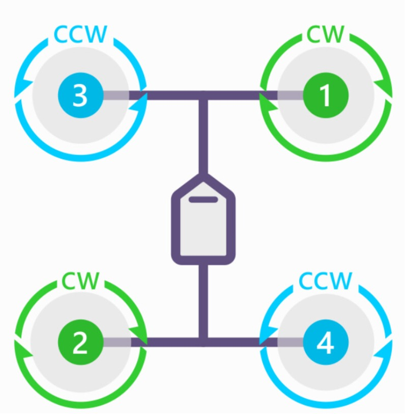

# Tutorial 3 - Basic control law components
The current control law for multirotor follows a modular design the there exist different feedback controller in a cascaded fashion. The flight mode manager chooses which controllers are enable. The resulting commands from the controller are converted to throttle commands to each motor. This tutorial covers the basics components of a multirotor control laws including the motor mixing system, arm/disarm system and flight mode management system. This tutorial and the code within are for reference only and should not be built as is. 

This ReadMe provides a brief description of these topics, more details can be found from comments in ```/simulation/vms/multirotor.slx```

## Hardware components
Although this tutorial is for reference only and no hardware is needed, having a fully configured quadrotor might be useful. For LAGER users, the tutorial covers in details MALT and LAMBU. If one wishes to follow with hardwares, ensure that the vehicle is able to enter flight loop without any error messages

## Motor mixing system
Multirotor needs to control the throttle commands to each motor to achieve a desired rotational acceleration. It is impractical to design a control loop for each motors due to the coupling of one motor can actuate multiple degrees of freedom. Therefore, lager_spaaro implements a motor mixing system similar to the one used by [Arducopter](https://ardupilot.org/dev/docs/code-overview-copter-motors-library.html) and [PX4](https://docs.px4.io/v1.12/en/concept/mixing.html). 

To summarize, motor mixing takes in higher level commands from the feedback controllers such as pitch, roll, yaw and collective thrust effort. The motor mixing then scale and add those commands to compute corresponding throttle commands to each motors. The scale factor from a particular command such as pitch will be different for each motor based on the motor's position relative to the CG. 

Generally, for multirotor systems with fixed pitch propeller and actuators, feedback control loop usually output 4 commands including pitch, roll, yaw and collective thrust. Assume that the multirotor has ```N``` number of motors. A motor mixing matrix of size ```Nx4``` is defined in the corresponding ```/simulation/aircraft/<VEHICLE_NAME>.m```. Each row corresponds to a motor mapped to a PWM channel. Each collumn corresponds to a contribution to a control axis in this order, collective, roll, pitch, yaw. In the control law, after the 4 high level commands have been output by the feedback control loop, the 4 commands are reshaped to a row vector and multiplied with the transposed mixing matrix. The resulting row vector contains the throttle command to each motors.

A quick example is as followed. For a quadcopter with the following motor configuration which is viewed from the top down.



To construct the mixing matrix, it is helpful to note down if an increase in throttle for a particular motor will result in a positive or negative rotation. For example with motor 1, the contribution to thrust is positive (increase throttle causes moe thrust up) so value is 1. The contribution to pitch is positive (increase throttle causes pitch up) so value is 1. The contribution to roll is negative (increase throttle causes roll left) so value is -1. The contribution to yaw is negative (increase throttle causes yaw left) so value is -1. The resulting first row in the mixing matrix is ```1,1,-1,1```. Following this logic, the following mixing matrix can be defined in ```/simulation/aircraft/<VEHICLE_NAME>.m```

```
Aircraft.Motor.mix = [1, -1,  1, -1;...
                      1,  1, -1, -1;...
                      1,  1,  1,  1;...
                      1, -1, -1,  1;...
                      0, 0, 0, 0;...
                      0, 0, 0, 0;...
                      0, 0, 0, 0;... 
                      0, 0, 0, 0];
```
It is noted that each elements in the matrix can be assigned the value within ```[0, 1]```, and the example above assigned them all as 1, it might be useful to assign them to somewhere in between depending on the frame geometry and motor to weight so that the motors and their efforts are not saturated. Since this is a quadcopter, only the first 4 rows are assigned. The remaining are left and can still be command via different means such as servo commands, etc. 

## Arm/Disarm system
The aircraft propulsion system has an armed and disarmed state. When armed, the motors are allowed to spin and will do so depending on the throttle command. During disarmed, the motor will not spin regardless of what throttle command is being fed. The arm state is not control anywhere in C++ portion of SPAARO but rather fully implemented in Simulink control law (Simlink arm state is passed to C++ under the name ```vms.motor_enabled``` only for telemetry situational awareness and logging).

Currently, the arm state is controlled by the pilot with two mechanisms and by the autopilot depending on the flight mode. For pilot controlled arming, the mechanisms are manual arming and emmergency stop. For manual arming, the pilot issue an arm/disarm command via the RC transmitter (currently implemented as rudder arming similarly to the [Arducopter implementation](https://ardupilot.org/plane/docs/parameters.html#arming-rudder)). Emmergency stop mechanism provide a software kill switch (usually bound to a toggle switch on the RC transmitter). When the switch is flip, the motors are immideately issued with 0 throttle command while the arm state are also transition from armed to disarmed (Emmergency Stop only disarm, cannot arm the vehicle).

Autonomous disarm is currently only available in the LAND mode. The idea is that LAND mode happens after an autonomous flight plan or Return to Launch mode. LAND mode only issue a down velocity command to the vehicle while trying to keep the vehicle in place laterally. After the aircraft is below an altitude threshold from the home altitude, LAND mode switch the arm state to disarm. In the current implementation, after LAND mode has disarm the vehicle, a power cycle is recommended. It has not been tested with re-arming after LAND mode execution (see note for Finite State Machine below). 

One thing to note is that for multirotor systems, it is adviced not to issue zero throttle command during flight to prevent motor sync or cogging problem. Therefore, when armed, even with zero throttle command, the motor will be given a minimum throttle command to keep them spinning without producing much thrust (defined in ```/simulation/aircraft/<VEHICLE_NAME>.m``` with variable ```Aircraft.Control.motor_spin_min``` which ranges from 0 to 1). For bigger propeller, it is also recommended to ramp up the throttle from 0 to ```Aircraft.Control.motor_spin_min``` when aircraft enter armed state.

## Flight mode management system
Currently, SPAARO utilizes a series of logic switches to handle state transitions. The pilot can control the flight mode (stabilized, pos_hold and enter auto mode) of the aircraft via a flight mode switch. The control law also enter certain flight modes depending on other conditions. More detail is in ```/simulation/vms/multirotor.slx```.

NOTE FROM TUAN: Our current implementation of flight mode is not the best as there are still undefined behavior and event that have yet been tested for. A better approach is to use an actual Finite State Machine. Simulink has a system to build Finite State Machine called StateFlow and it would be nice if someone can build a correct state machine for SPAARO. 
