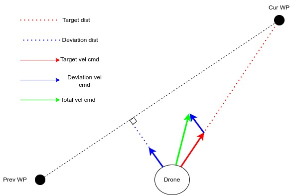

# Tutorial 4 - Multirotor feedback flight modes
The current control law for multirotor follows a modular design the there exist different feedback controller in a cascaded fashion. The flight mode manager chooses which controllers are enable. This tutorial and the code within are for reference only and should not be built as is. 

This ReadMe provides a brief description of these topics, more details can be found from comments in ```/simulation/vms/multirotor.slx```

## Cascaded control loops
The control law utilize multiple cascaded PID loops to both simplify control design and allow for easy of flight mode handling similar to one implemented by [PX4](https://docs.px4.io/main/en/flight_stack/controller_diagrams.html). The list of control loops are (in order from inner to outer)

* Angular rate controller: PID + Feedforward
* Angle controller: PID 
* Body velocity controller: PID
* Position controller: P 

A good overview of PID controller can be viewed [here](https://www.youtube.com/watch?v=4Y7zG48uHRo).

In the cascaded scheme, the output of the outer loop becomes the input of the inner loops

## Angular rate and angle controller block
The angle and angular rate controller is combined into one block. The entire block enable Stabilized control flight mode where the right stick control pitch and roll tilt angle. The left stick controls yaw rate and raw collective throttle command.

Inputs:
* pitch angle (rad)
* roll angle (rad)
* yaw rate (radps)
* collective throttle command

Outputs:
* This controller output the 4 effort commands to be fed into the motor mixing matrix.

Note: yaw rate controller is handled differently. When the yaw stick is centered (0 yaw rate command), the yaw rate controller set the current heading angle as a setpoint for a heading controller. Otherwise, the yaw rate controller pass the yaw stick deflection as yaw rate to the PID controller directly. This is to ensure good heading tracking when no yaw rate command is set (eliminate heading drift)

## Body acceleration to angle conversion block
Before looking at the body rate controller block which takes in velocity commands and output acceleration both in earth frame needed to track those commands. However, the yaw, pitch and roll commands are generally defined in the body frame. This block is used to convert the earth frame acceleration commands to body frame angles and collective thrust command

For conventional multirotor where all motor points upward, the system is under actuated i.e. for 6 DOF of motion (xyz translations and rotations), we have 4 DOF of control (heading, pitch, roll, and thrust). One can think of controlling a drone by controlling where the thrust vector is pointing. During hover with zero heading, the thrust vector is pointing straight up with 1g magnitude. To translate right, the thrust vector needs to be pointing right. The magnitude also needs to be increase to ensure the vertical component of the thrust vector maintain 1g. One can vary the magnitude such that the vertical component of thrust vector be different to 1g to increse or decrease altitude. It is note that the pitch and roll angle calculation take into account the current heading as well. 

## Translational velocity controller
This controller takes in the velocity commands and output acceleration both in earth frame. This block is to emulate Loiter mode. 

Inputs:
* earth frame x vel (mps)
* earth frame y vel (mps)
* yaw rate (radps)
* earth frame z vel (mps)

Outputs:
* earth frame x acc (mps^2)
* earth frame y acc (mps^2)
* yaw rate (radps)
* earth frame z acc (mps^2)

When the x,y,z vel commands are zeros, this block switch to its internal autonomous controller where the WP is set to the current position. 

Note: When the velocity command comes from the pilot, the sticks are actually in body frame. The input translation block convert the body XY vel to inertial XY vel given the current heading.

## Waypoint controller 
This block drives the aircraft the the predefined WP coordinates in ```telem.flight_plan```. It also check to see if a waypoint is reached by using a threshold defined as ```Aircraft.Control.wp_radius``` in ```/simulation/Aircraft/<VEHICLE_NAME>.m```. If reached, it toggle the ```vms.advance_waypoint``` so the C++ can iterate to the next WP index. It is noted that this controller does not just regulate the XYZ position error independently but rather try to follow a line connecting the previous waypoint and the next waypoint. At the end of the flight plane list, it also switch the flight mode to LAND

A visualization of the line following mechanism of the lateral position controller is shown below



Inputs:
* NO MANUAL INPUT. MODE READS FLIGHT PLAN AND MAKES CALCULATION

Outputs:
* earth frame x vel (mps)
* earth frame y vel (mps)
* yaw rate (radps)
* earth frame z vel (mps)

## Land controller
This controller bring the aircraft straight down why trying to maintain its lateral position. It sends out zero lateral velocity command and a constant Z vel command downward. When the altitude is below a threshold, it also send a disarm command.

Inputs:
* NO MANUAL INPUT. MODE READS FLIGHT PLAN AND MAKES CALCULATION

Outputs:
* earth frame x vel (mps)
* earth frame y vel (mps)
* yaw rate (radps)
* earth frame z vel (mps)